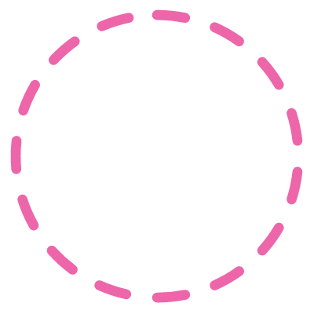
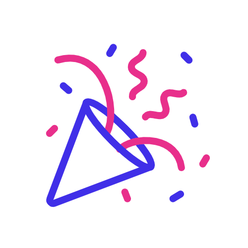

<h1 align="center"><b>Hello.World</b>
       {}</h1>
    
<h3 align="center">I am here to Learn 🙂 && Contribute🌱</h3> 

        &nbsp;

        <h1 align="center">About Me</h1>
        
- 🌈 I’m currently working on my **Web development and Problem Solving skills(DSA)**.
- 🌱 I’m currently pursuing my **Btech** degree in **Computer Science**.
- 💗 I love to design website **UX|UI**.
- 📄 I love reading books on **self growth**.(reading habit helps me in development as 🙂I need to read many docs during development)
- ⚡ I believe that **Innovation is a must for humans survival and growth**.

<h1 align="center">Technologies 💻&nbsp;🌱(I have worked with)</h1>

    
- 💻 **HTML| CSS | JavaSricpt**.
- 🔧 **C | C++**.
- 🔨 **Node.js | Express.js | React**.
- ✂️ **Figma | UX/UI**.
- 📊 **MongoDb**.

       <h1 align="center">Stats</h>
       

 

        

        

        

<h1 align="center">Connect with me</h1>
        

<a href="https://www.linkedin.com/in/mansi2020/">
      &nbsp;
 </a>&nbsp;
<a href="mailto:mansistartup2024@gmail.com">
      &nbsp;
</a>
<a href="#">
      &nbsp;
</a>
   

  

